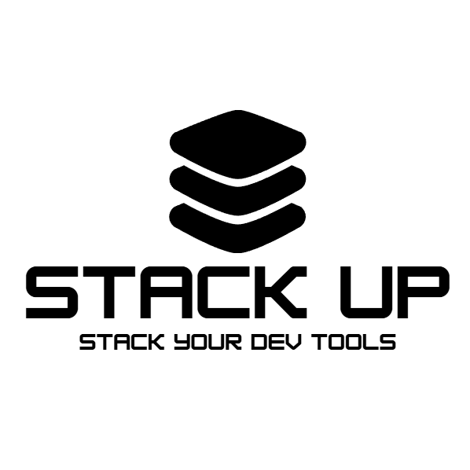

# StackUp 🚀


StackUp is a cross-platform developer environment installer that lets you set up your entire development toolchain with a single command. Define your tools once in YAML, run everywhere.

[](https://opensource.org/licenses/MIT)
[](https://golang.org)



## ✨ Features

- 🌍 **Cross-platform** - Windows, Linux, and macOS support
- 📦 **Smart package managers** - Uses apt, dnf, pacman, brew, winget, chocolatey 
- 🔗 **Dependency management** - Automatic installation order
- 🎯 **Complex installations** - Multi-step commands (WSL, Docker, etc.)
- 🔄 **Version managers** - Built-in support for nvm, pyenv, rustup
- ✅ **Verification** - Confirms tools are installed correctly
- 📝 **Single YAML config** - All tools defined in one place
- 🎨 **Presets** - Quick setup profiles for common stacks

## 🚀 Quick Start

### Installation

**From source:**
```bash
git clone https://github.com/araldhafeeri/stackup.git
cd stackup
go build -o stackup
```

**Or download the binary** from releases.

### Basic Usage

1. **Create a config file in the same directory of stackup binaries** (`stackup.yaml`):

```yaml
profile: web-dev

settings:
  auto_update_path: true
  verify_installations: true

tools:
  - name: git
    display_name: "Git"
    version: latest
    linux:
      package_names:
        apt: git
    macos:
      brew: git
    windows:
      package_names:
        winget: Git.Git

  - name: node
    display_name: "Node.js"
    version: "20.x"
    linux:
      package_names:
        apt: nodejs
    macos:
      brew: node@20
    windows:
      package_names:
        winget: OpenJS.NodeJS
```

2. **Run the installer:**

```bash
./stackup install stackup.yaml
```

That's it! StackUp will detect your OS, use the appropriate package manager, and install everything.

## 📖 Documentation

### Configuration Structure

```yaml
profile: <profile-name>          # Optional: Name your setup

settings:
  auto_update_path: true          # Add tools to PATH
  verify_installations: true      # Verify each installation

tools:
  - name: <tool-id>               # Unique identifier
    display_name: <friendly-name> # Optional: Display name
    version: <version>            # Version to install
    description: <description>    # Optional: What this tool does
    dependencies: [<tool-ids>]    # Optional: Install these first
    requires_reboot: false        # Optional: Needs restart
```

### Advanced Features

#### Multi-Step Commands (WSL Example)

```yaml
tools:
  - name: wsl
    display_name: "Windows Subsystem for Linux 2"
    windows:
      custom_commands:
        - command: wsl
          args: ["--install"]
          description: "Enable WSL feature"
          wait_for: 5
        - command: wsl
          args: ["--set-default-version", "2"]
          description: "Set WSL 2 as default"
        - command: wsl
          args: ["--install", "-d", "Ubuntu"]
          description: "Install Ubuntu"
          wait_for: 30
    requires_reboot: true
```

#### Pre/Post Install Commands

```yaml
tools:
  - name: docker
    pre_install:
      - command: echo
        args: ["Preparing Docker installation..."]
        description: "Pre-installation message"
    
    post_install:
      - command: docker
        args: ["--version"]
        description: "Verify Docker installation"
      - command: usermod
        args: ["-aG", "docker", "$USER"]
        description: "Add user to docker group"
        sudo: true
```

#### Custom Installation Scripts

```yaml
tools:
  - name: node
    display_name: "Node.js (via NVM)"
    custom_install:
      - command: bash
        args: ["-c", "curl -o- https://raw.githubusercontent.com/nvm-sh/nvm/v0.39.0/install.sh | bash"]
        description: "Install NVM"
      - command: bash
        args: ["-c", "source ~/.nvm/nvm.sh && nvm install 20"]
        description: "Install Node.js 20"
        wait_for: 5
```

#### Dependencies

```yaml
tools:
  - name: wsl
    display_name: "WSL 2"
    # ... configuration

  - name: docker
    display_name: "Docker Desktop"
    dependencies: ["wsl"]  # Docker needs WSL on Windows
    # ... configuration
```

### Command Options

Each command supports:

- `command`: The command to execute
- `args`: Array of arguments
- `description`: What this command does
- `sudo`: Run with elevated privileges (default: false)
- `wait_for`: Seconds to wait after execution
- `ignore_error`: Continue if command fails (default: false)

### Platform-Specific Configuration

```yaml
tools:
  - name: git
    windows:
      package_names:
        winget: Git.Git
        choco: git
    linux:
      package_names:
        apt: git
        dnf: git
        pacman: git
    macos:
      brew: git
```

### Presets

Define reusable tool collections:

```yaml
tools:
  - name: git
    # ...
  - name: node
    # ...
  - name: docker
    # ...

presets:
  web-dev:
    description: "Web development stack"
    tools: ["git", "node"]
  
  full-stack:
    description: "Full stack with containers"
    tools: ["git", "node", "docker"]
```

## 🎯 Use Cases

### Web Development Setup

```yaml
profile: web-development

tools:
  - name: git
  - name: node
  - name: vscode
    post_install:
      - command: code
        args: ["--install-extension", "dbaeumer.vscode-eslint"]
      - command: code
        args: ["--install-extension", "esbenp.prettier-vscode"]
```

### Data Science Environment

```yaml
profile: data-science

tools:
  - name: python
    display_name: "Python (via pyenv)"
    custom_install:
      - command: curl
        args: ["https://pyenv.run"]
      - command: bash
        args: ["-c", "curl https://pyenv.run | bash"]
      - command: bash
        args: ["-c", "pyenv install 3.11"]
  
  - name: jupyter
    dependencies: ["python"]
```

### DevOps Toolkit

```yaml
profile: devops

tools:
  - name: docker
  - name: kubectl
  - name: terraform
  - name: aws-cli
```

## 🔧 Commands

```bash
# Install tools from config
stackup install <config.yaml>

# Show version
stackup version

# Show example config
stackup example
```

## 🧪 Testing

Run the test suite:

```bash
# All tests
go test -v

# With coverage
go test -cover

# Specific test
go test -run TestDependencyResolution -v

# Benchmarks
go test -bench=. -benchmem

# Generate coverage report
go test -coverprofile=coverage.out
go tool cover -html=coverage.out
```

## 📋 Requirements

- **Go 1.25.5+** for building from source
- **Internet connection** for downloading tools
- **Package manager** (recommended):
  - Windows: winget or chocolatey
  - macOS: Homebrew
  - Linux: apt, dnf, or pacman
- **Administrator/sudo privileges** for system-wide installations

## 🗺️ Roadmap

- [ ] Interactive mode for config generation
- [ ] Update command (`stackup update`)
- [ ] Doctor command (`stackup doctor`) for diagnostics
- [ ] Rollback capability
- [ ] Profile switching
- [ ] Cloud config sync
- [ ] GUI application
- [ ] Homebrew/apt distribution
- [ ] Plugin system for custom installers

## 🤝 Contributing

Contributions are welcome! Please feel free to submit a Pull Request.

1. Fork the repository
2. Create your feature branch (`git checkout -b feature/amazing-feature`)
3. Commit your changes (`git commit -m 'Add some amazing feature'`)
4. Push to the branch (`git push origin feature/amazing-feature`)
5. Open a Pull Request

## 📄 License

This project is licensed under the MIT License - see the [LICENSE](LICENSE) file for details.

## 🙏 Acknowledgments

- Inspired by tools like Homebrew, Chocolatey, and Ansible
- Thanks to the Go community for excellent libraries
- Special thanks to all contributors

## 🌟 Star History

If you find StackUp useful, please consider giving it a star on GitHub!

---

**Made with ❤️ by developers, for developers**